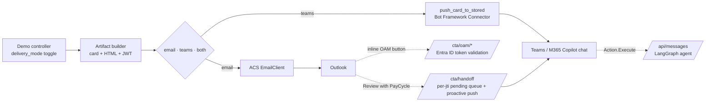

# PayCycle — Payroll-in-M365 Demo

A working, end-to-end demo of a **payroll-processor ISV agent** distributed in
the Microsoft 365 ecosystem. Designed to illustrate the architecture options
discussed in customer engagements where the question is:

> *"What is the right way to bring payroll workflows into the M365 flow of work
> — Outlook, Microsoft Teams, and M365 Copilot — so users don't have to come
> back to our web app to take action?"*

The product, employees, and pay batches are entirely fictitious. Branding =
**"PayCycle"** by **Acme Manufacturing** (a fictional customer).

---

## What it demonstrates

### Scenario

Maria is a payroll admin at Acme Manufacturing. Her company runs **PayCycle**
as their payroll processor. During the May-B pay cycle:

- Joseph Smith logged 14h of overtime — **3.4× his trailing average**.
- Sarah Lee has 12 PTO hours from the previous cycle that were never approved.

PayCycle's backend detects both anomalies. From the demo console you can deliver
the notification in **either of two modes** (or both), then complete the
full Maria → David approval loop end-to-end.

| Mode | Where Maria sees it | Notes |
|---|---|---|
| **A. Email (ACS → Outlook)** | Her inbox as an actionable email | OAM-aware clients render the inline Adaptive Card; everyone else sees a polished HTML body with a single "Review with PayCycle Assistant" button. Same backend code, same handoff token. |
| **B. Proactive Teams** | Directly in her PayCycle bot chat | Skips email entirely. Uses the cached `ConversationReference` captured the first time she said hi to the bot. |

In either mode, clicking through lands her in Teams with the **exact context
for that specific notification** — and if she has multiple pending
notifications, each one is replayed with its own context (no merging, no
overwriting). She talks to a LangGraph agent that uses semantic tools over the
mock backend ("show me the variance", "approve overtime", "is the PTO already
in a trailing batch?"), resolves both exceptions, and submits the batch.

PayCycle then emails (or proactively Teams-pushes) **David** the manager-approval
notification with first-class Approve / Reject actions. The full flow works the
same way in Microsoft 365 Copilot side-rail too — the bot is published as a
Custom Engine Agent.

> 📐 **Deep dive:** see [`docs/architecture.md`](docs/architecture.md) for
> the full component diagram, sequence diagrams for both delivery modes, and a
> per-capability walkthrough (dual-mode rendering, concurrent context isolation,
> OAM authentication, proactive Teams delivery, etc.).

### Architecture (high-level)



### Patterns implemented

| Pattern | Where it shows up |
|---|---|
| **Dual-mode email rendering** (OAM card + HTML fallback in the same MIME body) | `src/email_service/templates.py`, `src/email_service/sender.py` |
| **Proactive Teams notification** (Mode B) via stored `ConversationReference` | `src/demo_console/routes.py:_deliver_*_via_teams`, `src/bot/proactive.py` |
| **Per-`jti` pending-card queue** so multiple concurrent email notifications stay isolated | `src/bot/conversation_store.py:push_pending_card`, `drain_pending_cards` |
| **Outlook actionable email** with `Action.Http` + `Action.ShowCard` + `Action.OpenUrl` | `src/cards/builders.py`, `src/app.py:/cta/oam/*` |
| **OAM Entra ID token validation** for inline `Action.Http` buttons | `src/common/oam_auth.py` |
| **Single-use signed JWT** on every CTA URL with replay protection | `src/common/tokens.py` |
| **In-email card refresh** via the `CARD-UPDATE-IN-BODY` response header | `src/app.py:_outlook_card_response()` |
| **Action.Execute** invoke handlers (refresh card inside Teams) | `src/app.py:_handle_invoke()` |
| **M365 Copilot Custom Engine Agent** distribution via the same app manifest | `manifests/m365/manifest.json` |
| **Multi-tenant bot** (UAMI federated identity, no client secret in the hot path) | `src/bot/proactive.py:_get_app_token` |
| **LangGraph React agent** with persona-scoped system prompts and tool-calling | `src/agent/graph.py` |

---

## Quick demo run

> Skip to **Sideload the app** below if you only want to click through
> the end-to-end flow.

**Live URL:** <https://payroll-m365-demo.politeground-c0ea36c5.eastus2.azurecontainerapps.io>

**Demo console (no auth, internal):**
<https://payroll-m365-demo.politeground-c0ea36c5.eastus2.azurecontainerapps.io/demo/console>

From the console you can, for each step, pick `📧 Email`, `💬 Teams`, or
`📧+💬 Both` as the delivery mode and watch the same notification arrive in
the chosen channel(s):

1. **Notify Payroll Admin** of open exceptions → goes to
   `james.nguyen@microsoft.com` (playing Maria).
2. **Submit batch as Maria → notify David** for approval.
3. **Reset state** to start the demo over.

> ⚠ Inline action buttons inside the Outlook email require a one-time
> customer-admin setup (OAM provider + Entra app). See
> [`docs/actionable-email-admin-setup.md`](docs/actionable-email-admin-setup.md)
> for the generic guide and [`docs/oam-registration.md`](docs/oam-registration.md)
> for the demo-tenant steps. If the customer hasn't completed setup, the email
> still arrives as a fully readable HTML body with a "Review with PayCycle
> Assistant" button that opens Teams with the right context — **no admin
> setup required for that fallback**. The proactive Teams delivery mode also
> needs no email setup at all.

---

## Sideload the app

1. Build the package:

   ```bash
   cd manifests/m365 && zip -j payroll-demo-app.zip manifest.json color.png outline.png
   ```

   (already shipped at `manifests/m365/payroll-demo-app.zip`)

2. In Teams → Apps → *Manage your apps* → *Upload an app* → *Upload a custom
   app* → select the zip. Pin it to chat.

3. In Microsoft 365 Copilot → *Agents* → *Add agent* → *Custom* → upload
   the same zip. The agent will appear in the side rail.

4. Say *hi* to the agent once in Teams **before** triggering the first email —
   this is how the bot captures your `ConversationReference` so that subsequent
   proactive pushes have somewhere to go. (This step would be replaced by a
   formal sign-in / subscription flow in production.)

---

## Local dev

```bash
git clone https://github.com/james-tn/payroll-m365-demo
cd payroll-m365-demo
uv venv --python 3.12
uv pip install -e .
cp .env.example .env  # fill in values
uv run uvicorn src.app:app --reload --port 8080
```

Run the smoke tests:

```bash
uv run --with pytest pytest tests/ -v
```

Tunnel to a public URL for bot testing:

```bash
devtunnel host -p 8080 --allow-anonymous   # or ngrok http 8080
# update the Bot endpoint to https://<tunnel>/api/messages
```

---

## Redeploy

```bash
infrastructure/deploy.sh
```

Rebuilds the image with ACR Tasks (no local Docker needed) and rolls a new
revision on the Container App.

---

## Azure resources

All in subscription `840b5c5c-3f4a-459a-94fc-6bad2a969f9d`,
resource group `payroll-m365-demo-rg`, region `eastus2`.

| Kind | Name |
|---|---|
| Azure Communication Services | `paycycle-acs-31210` |
| ACS Email service | `paycycle-email-svc` |
| Email sender mailbox | `DoNotReply@8cd3731a-c37e-4ac9-88d0-876dbcf5c3de.azurecomm.net` |
| Container Registry | `payrollm365demo1928` |
| Container Apps environment | `payroll-cae` |
| Container App | `payroll-m365-demo` |
| Bot service | `payroll-m365-demo-bot` |
| Bot Entra app (multi-tenant) | `8412d807-a2f1-4890-b106-a500c67e92a5` |
| Azure OpenAI | `eastus2oai` (deployment: `gpt-5.2-chat`) |

---

## Architecture diagram (logical)

For the full diagrams, per-capability walkthrough, and production-hardening
checklist, see **[`docs/architecture.md`](docs/architecture.md)**.

```
              ┌──────────────────────────────────────────┐
              │   PayCycle backend (this repo, ACA)      │
              │                                          │
              │   FastAPI app                            │
   ┌──────────┤   ├── /api/messages  (Bot Framework)    │
   │          │   ├── /cta/approve   (Outlook Action.Http for manager)
   │          │   ├── /cta/oam/*     (Outlook Action.Http for admin, Entra-validated)
   │          │   ├── /cta/handoff   (Outlook/Teams handoff, per-jti queue)
   │          │   └── /demo/console  (operator UI with delivery-mode toggle)
   │          │                                          │
   │          │   LangGraph React agent (Azure OpenAI)  │
   │          │   FlexStore in-memory (mock backend)    │
   │          └─────────────────────────────────────────┘
   │                          │                ▲
   │                          │                │ proactive push (Mode B
   │   email (Mode A          │ proactive      │ direct, or Mode A handoff)
   │   via ACS)               │ thread create  │ via stored ConversationReference
   │                          ▼                │
   │   ┌──────────┐    ┌──────────┐    ┌──────────────┐
   └──►│ Outlook  │    │ M365     │    │  Microsoft   │
       │ inbox    │◄──►│ Copilot  │◄──►│  Teams       │
       │          │    │ side rail│    │  bot chat    │
       └──────────┘    └──────────┘    └──────────────┘
                          ▲                ▲
                          │                │
                          └── user: james.nguyen@microsoft.com
                              (plays both Maria and David)
```

---

## Why two-stage email + chat handoff?

For a **payroll-processor ISV** working in someone else's tenant, every
notification surface has different trade-offs:

| Channel | Strength | Limit |
|---|---|---|
| Outlook actionable email | Lives where users already work; survives multi-day workflows; multi-tenant by default | Inline action buttons require a one-time OAM + Entra app setup per customer; action set is fixed at send time; no long-running interactive dialogue |
| Teams / Copilot agent chat (proactive) | Rich back-and-forth; long-running messages; refresh cards; agent reasoning; zero email-admin setup | Requires the user to have *touched* the bot once so a `ConversationReference` exists; needs the app installed in their tenant |

The pattern this demo lands on:

1. **Notification = caller's choice.** Either Mode A (email, default) or
   Mode B (proactive Teams, skips email). Same backend code, same Adaptive
   Card content, same handoff token.
2. **Happy-path action stays in the surface where the user is.**
   - Mode A: one-click inline `Action.Http` in Outlook, refreshed via
     `CARD-UPDATE-IN-BODY` — no app switch.
   - Mode B: one-tap `Action.Execute` in Teams, refreshed via invoke.
3. **Anything that needs reasoning = handoff to the PayCycle agent.**
   In Mode A the "Review with PayCycle Assistant" button hits `/cta/handoff`,
   the backend pushes a context-laden card proactively, then 302s to the
   Teams deep link. In Mode B the card is already in Teams.
4. **Multiple concurrent notifications stay isolated.** Each email mints a
   unique `jti`-bound handoff token; the bot's pending-card queue replays
   each one separately when the user comes back.

The customer doesn't have to choose Outlook *or* Teams *or* Copilot up front —
they choose the **right surface per notification** and the agent is the same
agent across all three.

---

## Security notes (this is a demo)

- **Bot Entra app secret** and **ACS connection string** are stored as
  Container App secrets, not as plain env vars.
- **Token signing key** is generated at deploy time, also a Container App
  secret. CTA URLs carry a 60-minute single-use JWT (`jti` is tracked in-memory).
- **Multi-tenant JWT validation** in `src/app.py` does *not* pin issuer
  (`verify_iss=False`) so users from any tenant can authenticate against a bot
  whose Entra app lives in our tenant. Audience is validated against the bot
  app id. For production you would either (a) pin a tenant allow-list or
  (b) switch the Bot Service to `UserAssignedMSI` for first-class federated
  multi-tenant.
- The `/demo/console` operator UI has **no authentication** — fine for a
  short-lived public demo, **not** acceptable for any production-adjacent
  deployment.
- The mock FlexStore is **process-local in-memory**; restart the container
  and state resets.

---

## File layout

```
src/
  app.py                       # FastAPI: bot handler + CTA endpoints + OAM endpoints
  agent/graph.py               # LangGraph React agent + 6 tools
  bot/
    conversation_store.py      # in-memory ConversationStore + per-jti pending queue
    proactive.py               # bot app token (UAMI/secret) + push_card_to_stored
  cards/builders.py            # Adaptive Card JSON generators (email + Teams variants)
  common/
    config.py                  # Pydantic Settings
    logging.py
    oam_auth.py                # Entra ID JWT validation for OAM Action.Http
    tokens.py                  # signed single-use JWT helpers
  demo_console/routes.py       # /demo/console + delivery-mode dispatcher (email/teams/both)
  email_service/
    sender.py                  # ACS Email wrapper
    templates.py               # HTML body + optional embedded OAM card
  flex/store.py                # mock PayCycle backend + state machine
mock_data/
  company.json
  employees.json
  exceptions.json
  users.json
manifests/m365/
  manifest.json                # Teams + Copilot custom engine agent
  color.png  outline.png
  payroll-demo-app.zip         # sideload package
infrastructure/
  deploy.sh                    # rebuild + roll Container App revision
docs/
  architecture.md              # ← deep dive: diagrams + walkthrough + hardening checklist
  actionable-email-admin-setup.md  # generic customer-admin guide for inline OAM
  oam-registration.md          # demo-tenant OAM provider registration
tests/
  test_smoke.py                # store + cards + tokens
  test_concurrent_context.py   # per-jti queue + proactive dispatch
  generate-test-emails.py      # emit SendOam{Card,Html}Test.bas for VBA testing
Dockerfile
pyproject.toml
.env.example
```
