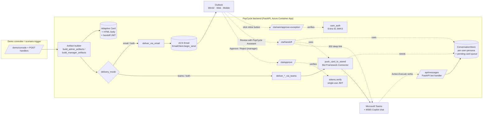
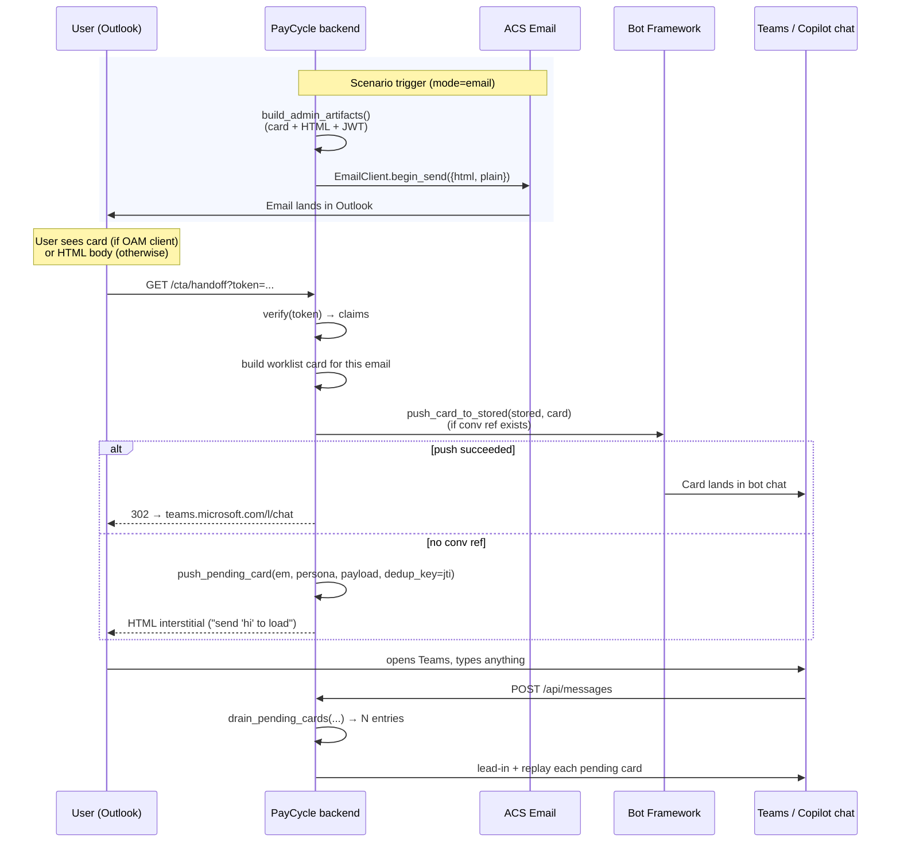
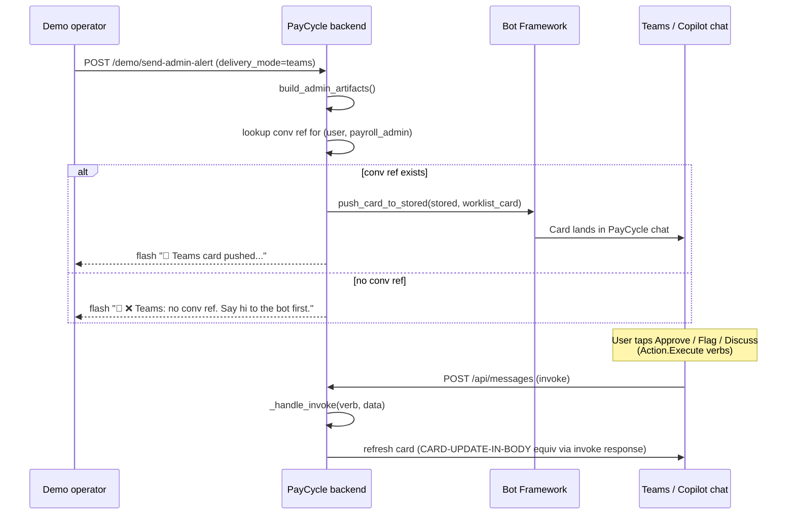

# PayCycle — Architecture & Walkthrough

End-to-end architecture for the PayCycle Payroll-in-M365 demo. This document
explains **every capability** the demo demonstrates, how it is implemented,
and how a real ISV would adapt the same patterns for production.

For the customer-admin steps that enable inline actionable buttons in Outlook,
see [`actionable-email-admin-setup.md`](actionable-email-admin-setup.md).
For the one-time OAM provider registration, see [`oam-registration.md`](oam-registration.md).

---

## TL;DR

Two delivery modes (selectable per notification from the demo controller):

| Mode | Trigger | Channel | When to use |
|---|---|---|---|
| **A. Email** (default) | `delivery_mode=email` | ACS Email → Outlook | The notification needs to *reach the user* even if they have never opened the M365 app; survives multi-day workflows. |
| **B. Proactive Teams** | `delivery_mode=teams` | Bot Framework Connector → Teams / Copilot chat | The user is actively in M365 and you already have a `ConversationReference` for them. Zero email setup needed for the customer admin. |
| **A + B** | `delivery_mode=both` | both | Belt-and-braces; demos that compare the two surfaces side-by-side. |

In **both** modes the same backend logic and the **same Adaptive Card content**
is used. The only thing that changes is the *transport* and the *action verbs*
inside the card (`Action.Http` for OAM-inside-email vs. `Action.Execute` for
in-Teams).

---

## Component diagram



Key facts:

- **One artifact builder** produces both the email body and the Teams card from
  the same inputs. The card's *transport-specific* action verbs differ but the
  data, layout, and handoff token are identical.
- **One token store** (`ConversationStore`) keeps:
  - `(email, persona) → ConversationReference` for proactive push
  - `(email, persona) → list[pending_card_payload]` — the per-email queue used
    when handoff happens before the user has a live bot chat. **Multiple
    concurrent notifications are isolated by `jti`** and replayed in order on
    the user's next bot message.

---

## Capability walkthrough

Each capability includes the source file and a brief explanation of how it is
implemented in code.

### 1. Dual-mode email rendering — automatic at the client

> The same email is delivered to every recipient. The recipient's mail client
> decides which UX they see.

**Implementation**: `src/email_service/sender.py`, `src/email_service/templates.py`.

Every email body that we send via ACS contains two payloads stacked inside the
same MIME `text/html` part:

```html
<head>
  <script type="application/adaptivecard+json">{ ...card json... }</script>
</head>
<body>
  ... full polished HTML body with a fallback CTA button ...
</body>
```

- **OAM-aware clients** (Outlook Win32 / Outlook for the Web in tenants that
  have registered our originator) render the `<script>` payload as an
  inline Adaptive Card *above* the HTML body. Inline `Action.Http` buttons
  fire silently against `/cta/approve` and `/cta/oam/*` endpoints; the card
  refreshes via the `CARD-UPDATE-IN-BODY` response header.
- **Every other client** (mobile Outlook, Outlook desktop without OAM, Gmail,
  Apple Mail, …) ignores unknown `<script>` types and shows the HTML body.
  The HTML body contains a single big **Review with PayCycle Assistant**
  button which hits `/cta/handoff?token=…` → 302 to the Teams deep link.

There is **no client detection on the server side** — the rendering choice
happens in the client. This is why the same backend code path covers both.

For the customer-admin steps required to unlock the inline-card experience
(provider registration + Entra app + scope rollout), see
[`actionable-email-admin-setup.md`](actionable-email-admin-setup.md).

### 2. Per-email context isolation (multiple concurrent notifications)

> If three separate notifications arrive while the user is away, and they
> later click "Review with PayCycle Assistant" on each one, the agent receives
> **three** distinct context loads — not one merged blob, and the last click
> does not overwrite the first.

**Implementation**: `src/bot/conversation_store.py`, `src/app.py:cta_handoff`,
`src/app.py:_handle_message`.

Each email mints its own short-lived JWT (`mint(purpose="handoff", …)`) carrying:

```json
{
  "purpose": "handoff",
  "sub": "<user-email>",
  "persona": "payroll_admin|payroll_manager",
  "batch_id": "...",
  "intent": "review_exceptions|review_for_approval",
  "event": "alert/CYC-2026-05B",
  "exception_ids": ["EXC-...", "..."],
  "jti": "<unique uuid>",
  "exp": ...
}
```

When the user clicks the email's CTA:

1. `/cta/handoff` decodes the JWT, looks up the **matching exception snapshot**,
   builds the specific worklist card for *that* notification.
2. If a `ConversationReference` exists for `(sub, persona)`, the card is pushed
   proactively (deduped by `jti` to survive Outlook prefetch + Defender Safe Links).
3. **Regardless** of whether the push succeeded, the card is also appended to
   the user's per-jti pending queue:
   ```python
   conv_store.push_pending_card(em, persona, payload, dedup_key=jti)
   ```
   `push_pending_card` *appends* (never overwrites); the `dedup_key` prevents
   the same email's preview/scrubber hits from queueing the card N times.

When the user's next bot message arrives:

```python
# src/app.py:_handle_message
pending_payloads = []
for em in candidate_emails:
    for entry in store.drain_pending_cards(em, persona):
        ...
        pending_payloads.append(entry)

if len(pending_payloads) > 1:
    # Send a "You have N pending notifications" lead-in, then replay each
    # card in order. None is lost or merged.
    await _reply_to_activity(activity, [], f"📨 You have **{N} pending notifications** ...")
    for entry in pending_payloads:
        await _reply_to_activity(activity, [entry["pending_card"]], entry["pending_card_text"])
```

The cards retain their original `event_id` and `batch_id`, so the agent's
in-card buttons (Approve, Flag, Discuss) self-identify which notification
they refer to.

### 3. Proactive Teams delivery (Mode B) — skip email entirely

> The controller picks `delivery_mode=teams`. The notification arrives directly
> in the user's PayCycle bot chat in Teams. No email is sent. **No "say hi to
> the bot first" requirement** as long as `DEMO_USER_AAD_OBJECT_ID` is configured
> and the bot's Teams app is installed in the user's personal scope.

**Implementation**: `src/demo_console/routes.py:_ensure_conv_ref`,
`_deliver_admin_via_teams`, `_deliver_manager_via_teams`,
`src/bot/proactive.py:create_personal_chat`, `push_card_to_stored`.

`_ensure_conv_ref(persona)` is the heart of this path:

1. **Reuse**: look up `(email, persona)` in `ConversationStore`. If found,
   short-circuit and return.
2. **Auto-create**: if no ref exists and `DEMO_USER_AAD_OBJECT_ID` +
   `DEMO_USER_TENANT_ID` are configured, call Bot Framework createConversation:
   ```
   POST {BOT_SERVICE_URL}/v3/conversations
   Authorization: Bearer <bot-app-token from UAMI>
   {
     "bot":    { "id": "28:<BOT_APP_ID>" },
     "isGroup": false,
     "members": [{ "id": "<DEMO_USER_AAD_OBJECT_ID>" }],
     "channelData": { "tenant": { "id": "<DEMO_USER_TENANT_ID>" } }
   }
   ```
   The response gives us a `conversation.id`. We build a synthetic
   `ConversationReference`, stash it under **both** personas (same user plays
   both roles in the demo), and proceed to push the card.
3. **Surface failures**: if neither config nor stored ref exists, return a
   non-throwing flash message:
   - "no conversation reference and auto-create is not configured…"
   - or "auto-create failed: createConversation 403 - bot not installed in
     this user's personal scope. Install PayCycle in Teams for the user once."

**Prerequisites for auto-create**:

| Required | Why |
|---|---|
| `BOT_APP_ID` + bot token (UAMI in this deployment) | Authenticates the createConversation call. |
| `DEMO_USER_AAD_OBJECT_ID` (env var) | Identifies the user in `members[].id`. Look up with `az ad user show --id <upn> --query id -o tsv`. |
| `DEMO_USER_TENANT_ID` (env var) | Required by Teams to route to the user's tenant. |
| `BOT_SERVICE_URL` (env var, defaults to `https://smba.trafficmanager.net/teams/`) | Where createConversation POSTs to. The default works for any tenant. |
| **Bot app installed in user's personal scope** | The user must have the PayCycle Teams app installed (via sideload or org catalog). Without this, createConversation returns 403. This is a **one-time** step per user, not a per-notification step. |

Once a chat is created, the conv ref persists for the lifetime of the
container; subsequent deliveries to either persona reuse it without another
createConversation round-trip.

- The proactive Teams card uses **the same handoff token** as the email
  variant would have. Any "Discuss with PayCycle agent" or post-action follow-up
  has identical downstream behavior.
- `push_card_to_stored` uses the cached app-only Bot Framework token (acquired
  via UAMI federated identity in this deployment — see `src/bot/proactive.py`).

### 4. Controller-side delivery toggle

> Per-scenario radio buttons in the demo console UI let the operator pick
> `email`, `teams`, or `both` for each notification.

**Implementation**: `src/demo_console/routes.py:_HTML_TEMPLATE` (form), plus
`_parse_channels` and the `await asyncio.gather(*tasks)` dispatcher in the
POST handlers.

When `both` is selected, the two delivery functions run concurrently and the
flash message shows both results:

```
Admin notification → 📧 Email queued to james@…  |  💬 Teams card pushed to james@… (msteams)
```

### 5. Email → Teams handoff sequence (Mode A path)



### 6. Direct proactive Teams sequence (Mode B path)



### 7. In-email actions — OAM authentication (`Action.Http`)

> When the OAM card's inline Approve / Flag button is clicked in Outlook, the
> request arrives at our backend with an **Entra ID bearer token** issued by
> Outlook to the **Microsoft Actionable Messages Service** on the user's behalf.

**Implementation**: `src/common/oam_auth.py`, `src/app.py:_verify_oam_request`,
`src/app.py:/cta/oam/approve-exception/{id}` and `/flag-exception/{id}`.

```python
async def verify_oam_bearer(token, *, expected_audiences, allowed_tenants=None):
    # 1. discover OIDC config for the issuer tenant
    # 2. fetch JWKS, cache per-tenant
    # 3. validate signature + aud (list, v1/v2 tolerant) + iss + exp + nbf
    # 4. optionally check tenant allow-list
```

The two endpoints respond with the `CARD-UPDATE-IN-BODY` response header so
Outlook replaces the inline card with a fresh one (e.g., "Approved by …").

For full admin setup of this path (provider registration, Entra app, pre-authorize
the Actions service), see [`actionable-email-admin-setup.md`](actionable-email-admin-setup.md).

### 8. In-email actions — legacy CTA path (manager Approve / Reject)

> The manager-approval email uses signed single-use JWTs in the URL, NOT OAM tokens.
> Works without any tenant-side admin setup beyond OAM provider registration
> (so the buttons render at all).

**Implementation**: `src/app.py:/cta/approve`, `/cta/reject`, `src/common/tokens.py`.

```python
def mint(purpose, subject, extra=None, ttl_seconds=3600):
    # HS256 JWT with jti, exp, purpose, sub, ...

def verify(token, expected_purpose, mark_used=True):
    # validates signature + purpose + jti not previously used (replay guard)
```

`jti` is added to an in-memory set on first use; subsequent uses are rejected.
For production, swap the set for a TTL cache (Redis) and a short window (e.g., 10m).

### 9. Multi-tenant bot identity

The bot is provisioned as a **UserAssignedMSI** Bot Framework app — the
Container App's user-assigned managed identity owns the bot Entra app, and
proactive push obtains tokens via federated identity (no client secret in
the bot's hot path).

`src/bot/proactive.py:_get_app_token()` supports three modes:
1. `UserAssignedMSI` — production path (this deployment)
2. `SingleTenant` — `client_credentials` against `<tenant>/oauth2/v2.0/token`
3. `MultiTenant` (legacy) — `client_credentials` against `botframework.com`

### 10. Conversation reference capture

> Every inbound bot activity (message, `conversationUpdate`) is snapshotted
> into the `ConversationStore` so future proactive pushes know where to go.

**Implementation**: `src/bot/conversation_store.py:upsert_from_activity`,
`src/app.py:_handle_conversation_update`, `_handle_message`.

In production, replace the in-memory store with Cosmos / Redis and also
subscribe to the bot install event so the conversation reference is captured
without requiring the user to send a message first.

### 11. Custom Engine Agent in M365 Copilot

The same bot + same `ConversationReference` work for **Microsoft 365 Copilot
side-rail** as for Teams chat. The `manifests/m365/manifest.json` declares the
bot with `runtimes` for both, and the surface is detected at `_handle_message`
time from `activity.channelId` (`msteams` vs Copilot-flavored channels).

---

## Concurrency model summary

| Concern | How it's handled |
|---|---|
| Two emails sent close together | Each gets a unique `jti`; each handoff click pushes its own card; pending queue is per-jti deduped. |
| User clicks same email twice | `jti` dedup at handoff endpoint + replay guard on JWT `jti` set + pending-card dedup all coalesce to a single delivery. |
| User clicks email then opens Teams before push succeeds | Pending-card queue replays on first message. |
| Three pending notifications, then one Teams message | Bot drains all three from queue, sends a "📨 You have 3 pending notifications" lead-in + replays each card in order. |
| Same user playing two personas (`payroll_admin` + `payroll_manager`) | Queues are keyed by `(email, persona)`; aliases share conv ref but each persona has independent queue. |
| Multiple bot replicas | **N/A** for this demo (single replica, in-memory store). Production: externalize ConversationStore + `_used_jtis` to Redis/Cosmos. |

---

## File map

```
src/
  app.py                      # FastAPI app: /api/messages, /cta/*, route registration
  agent/graph.py              # LangGraph React agent + 6 semantic tools
  bot/
    conversation_store.py     # in-memory ConversationStore + per-jti pending queue
    proactive.py              # push_card_to_stored, _get_app_token (UAMI/secret)
  cards/builders.py           # Adaptive Card JSON builders (email + Teams variants)
  common/
    config.py                 # Pydantic Settings (env → typed config)
    oam_auth.py               # Entra ID JWT validation for OAM Action.Http
    tokens.py                 # signed single-use JWTs for CTA URLs
    logging.py
  demo_console/routes.py      # operator UI + delivery-mode dispatcher
  email_service/
    sender.py                 # ACS EmailClient wrapper
    templates.py              # HTML body + optional embedded OAM card

docs/
  architecture.md             # this document
  actionable-email-admin-setup.md  # customer-admin guide for inline OAM
  oam-registration.md         # one-time OAM provider registration steps

tests/
  test_smoke.py               # store + cards + tokens
  test_concurrent_context.py  # per-jti queue + proactive dispatch
  generate-test-emails.py     # emits SendOam{Card,Html}Test.bas for VBA testing
```

---

## Production hardening checklist

These are intentionally **not** in the demo. Each is a 1–2 day task for the
team picking this up.

- [ ] Replace in-memory `ConversationStore` with Cosmos / Redis
- [ ] Replace in-memory `_used_jtis` replay set with a TTL Redis cache
- [ ] Capture `ConversationReference` on `conversationUpdate` install event,
      not just on the user's first message
- [ ] Move from `cta_token_secret` env var to Key Vault reference; rotate
- [ ] Authentication on the `/demo/console` operator UI
- [ ] Tenant allow-list on `OamAuth.verify_oam_bearer(allowed_tenants=...)`
- [ ] Audit-log everything to a sink (App Insights / Sentinel)
- [ ] Make `"PayCycle Assistant"` / "Acme Manufacturing" branding configurable
      so the same demo serves multiple ISV product names
- [ ] Rate-limit `/cta/handoff` and `/cta/oam/*` per user
